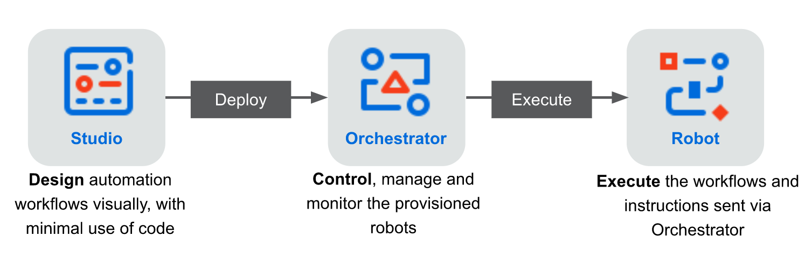

 # 11/18/2020 <!-- omit in toc -->
  - [Automation Methodology](#automation-methodology)
    - [RPA Basics](#rpa-basics)
      - [What is RPA?](#what-is-rpa)
      - [RPA vs. Automation](#rpa-vs-automation)
      - [RPA and AI](#rpa-and-ai)
      - [RPA and Emerging Ecosystem](#rpa-and-emerging-ecosystem)
      - [Industries best suited for RPA](#industries-best-suited-for-rpa)
      - [Business units best suited for RPA](#business-units-best-suited-for-rpa)
      - [Processes that can be automated](#processes-that-can-be-automated)
  - [Introduction to UiPath](#introduction-to-uipath)
    - [UiPath Methodology and Products](#uipath-methodology-and-products)
## Automation Methodology
### RPA Basics
Automation is the process which a procedure is executed with minimal human assistance
- What automation does:
    - Frees human resources to be better utilizaed in more productive work
- Where is Automation used?
    - In business & technology
- Example:
    - Automated bottle-filling stations
- Benefits of Automation:
    - Decreases operational cost
    - Descreases average handling time
    - Assists worker safety
    - Improves productivity
    - Save time, effort, and money
#### What is RPA?
Technology that enables a software program to mimic human actions while interacting with computer applications to accomplish required tasks
- Easy to implement and powerful to scale
- Works 24/7 without making errors
- Creates a digital robotic workforce
- Enables a software program to mimic human actions
- Operates on different applications
- Reads and processes data in a structured form
- Benefits of RPA
    - Increased executiion speed
    - Improved accuracy
    - Improved compliance and governance
    - Reduced cost of process execution
    - Easier scaling
    - Rapid ROI
#### RPA vs. Automation
|   RPA                                                                     | Automation                                                                   |
|---------------------------------------------------------------------------|------------------------------------------------------------------------------|
| used to automate any business process of functionality                    | used to automate a specific type of process                                  |
| platform independent                                                      | platform dependent                                                           |
| mimics user actions and can cognitively take decisions to perform actions | does not mimic user actions and only executes the given program instructions |
| Example: Chatbots, etc                                                    | Example: Calculators, washing machines, etc                                  |

#### RPA and AI
RPA is a robot that mimics human actions while AI is the simulation of human intelligence by machines
- AI:
    - Natural language processing
    - Machine learning
    - Natural Language Understanding
    - Chatbots
- RPA:
    - High-volume processes
    - Labor-intensive processes
    - Rule-based & repetitive processes
    - Processes with structured data
- Blending AI into RPA 
    - AI provied through AI Fabric which applies the cognitive power of AI to any software that can be automated by RPA. AI Fabric provides robots with the skills for:
        - Document understanding
        - Visual understanding
        - Conversational understanding

#### RPA and Emerging Ecosystem
Several technologies are emerging in the RPA ecosystem
- Process mining
- Intelligent OCR
- Reporting software
- Workflow management tools

#### Industries best suited for RPA
RPA solutions are being deployed in various industries globally. Some of the industries that benefit from RPA are
- Banking  and finance
- Insurance
- Healthcare
- Manufacturing
- Customer Service
- Travel/Transportation/Logistsic

#### Business units best suited for RPA
Some of the business units where RPA can be used for automating the processes are
- Sales
- Human resources
- Operations
- Information Technology
- Supply chain
- Finance and Accounting

#### Processes that can be automated
A process can be automated if it is:
- Rules-driven: rules-based and consistent
- Voluminous: high volumes of transactions
- Data-Intensive: lots of data manipulation and crunching
- Repetitive in Nature: involving manual & repetitve tasks
- Driven by Digital Inputs: begin by receiving data through digital files

## Introduction to UiPath
### About UiPath
#### UiPath Methodology and Products
- **Discover**: discover automation opportunities powered by AI
    - Automation Hub
    - Process Mining
    - Task Capture
    - Task Mining
- **Build**: build automations quickly
  - StudioX
  - Studio
  - Studio Pro
- **Manage**: Manage automation at enterprise scale
  - Automation Cloud
  - Orchestrator
  - AI Fabric
  - Test Suite
- **Run**: run automations through robots
  - Attended robotes
  - Unattended robots
  - AI robots
  - Test robots
- **Engage**: engage people and robots
  - Action Center
  - Assistant
  - Chatbots
- **Measure**: measure performance
  - Insights

#### UiPath Suite Architecture

### Robots and Their Types
#### Introduction to Robots
Robots are UiPath's execution agents that enable the user to run processes developed in Studio
- Mimic human actions
- Perform actions on applications, files, and data
- Perofrm complex calculations
- Work on predeined rules for decision making
- Are non-invasive and can work 24/7
- Improve process efficiency & saves time

#### Types of Robots
In UiPath, there are 2 types:

#### Attended Robots
- What do they do?
  - Collaborate with human worker for small and repetitive tasks
- Where do they run?
  - On the same machine with the user performs the day-to-day tasks
- How do they work?
  - Triggered by users or specific user events

 #### Unattended Robots
 - What do they do?
  - Run long processes or automations without human interaction
- Where do they run?
  - Any machine connected to Orchestrator
- How do they work?
  - Controlled through orchestrator

### Studio Overview
Studio is used to develop Robots

#### StudioX
Offers:
1. Complete solution for businesses to automate applications
2. Seamless integration with Microsoft Office applications (such as MS Excel)
3. Real-time graphic representation of automation project in Designed panel

#### Features of Studio
- **Productivity**: 
  - drag and drop activities
  - manage dependencies
- **Code Quality**
  - Workflow analyzer
  - create custom rules
  - validate
- **Extensibility**
  - Project template
  - browser extensions
- **Version Control**
  - Gut, TFS, SVN integration
  - File Diff and Compare Changes
- **Debugging**
  - Breakpoints
  - Call Stack, immediate, Locals, Watch
  - Test activity and create test bench
- **Reusability**
  - Libraries
  - Custom Templates
  
### Orchestrator