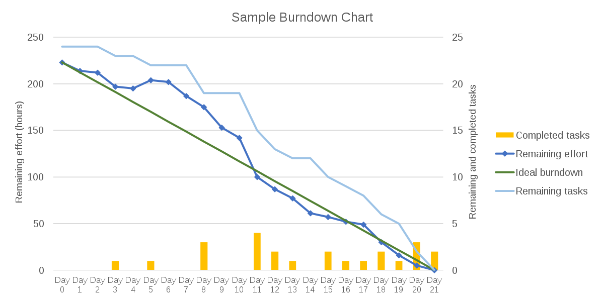
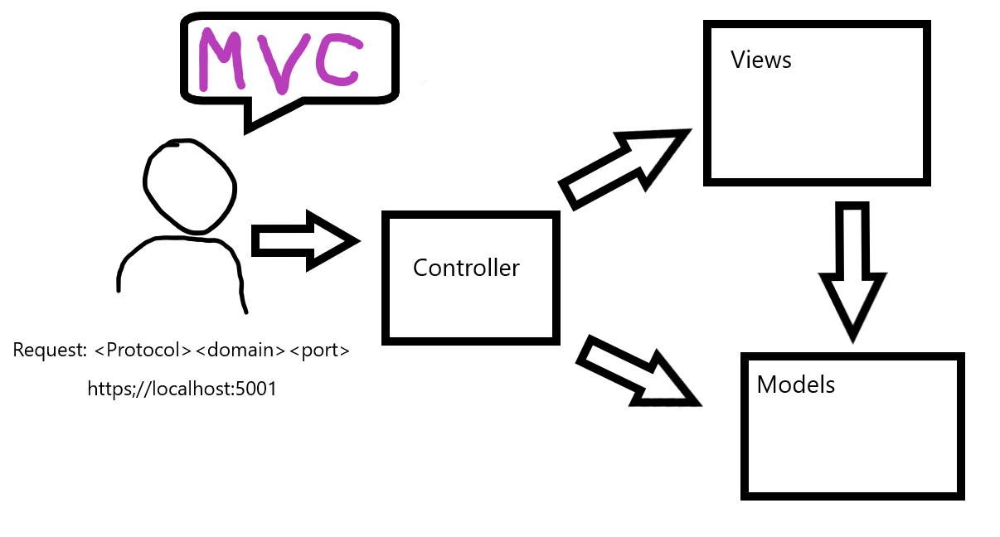

# 11/3/2020
## SDLC
### What is SDLC
- Software Development Lifecycle
- A Process used to design, decelop, and test high quality software
- Describes how a certain software was developed

### Big Bang Model
- 3 phases: Design? Build!!! Test?
- Good for prototypes, learning new languages and implementing some new feature without integrating it into the application

### Waterfall Model
- Rigid
- Highly documented
- You go through each phase once
- Good for project htat require on time delivery
	- Like software for rockets, or military projects

### V-Model
- AKA verification and calidation model
- An extension of the waterfall model and is based on the association of a testing phase for each corresphonding development stage
- the corresponding testing phase of the decelopment phase is planned in parallel

### Agile Development
- Agile is more of a concept than an actual methodology unlike the other models
- It's about being able to develop and deploy software quickly by not wasting time discussing design and planning
- It's about communicating consistently with the client and stakeholders about what they would want in the project and making plans on applying their request in an iterative way so that the current development would be disturbed
- [Agile Manifesto](https://agilemanifesto.org/)

### Scrum
- Popular implementation of the agile methodology

#### Phases:
- **Sprint Planning**
	- When you take user stories and asign points to them
	- Points = the amount of effort it would tak e to acomplish a user story
	- usually limited with a capacity - the number of work hours you have
- **Sprint**
	- The time you actually work on your user stories
	- You take a bunch of user stories and work on the,
	- Usually lasts 2-6 weeks
	- Whole team on same sprint
	- Frequent scrym meetings (standup)
		- Daily
		- 3 parts: what you worked on, what your're planning to work on, any blockers
		- Stand up as an incentive to sit back down again
		- Led by a scrum master/team lead
- **Sprint Review**
	- Review the doneness of you increment
	- verify invcrement against the definition of done and acceptance criteria
- **Sprint Retroscpective**
	- Review what happened in the last sprint
	- Take a look at your burndown chart
	- Evaluate your velocity

#### Backlog
- Contains the user stories that need to be implemented
- Each user story would have a point value, the value is the amount of effort it would take to implement the user story
- During splrint planning, you would assess which user storeis to tomplemetn based on their urgency annd match the total points against your capacity - the total amount of work hours you actually have

#### Project Board
- How you keep track of the project during the development
- Maintained by the scrum master

#### Burndown Chart
- Another way of keeping track of your progress during a sprint
- Is used in sprint review to see the sprint's velocity
- The velocity describes the total amount of points finished during sprint

### YOLO Development
- Not an actual (recognized) development methodology
- Similar to big bang, but makes it into production
- Only has one iteration
- Flexible to chnaging requirements
- All about taking requirements from product owner/project manager and coming up with something to show on project presentation
- Most apps developed under YOLO development are made once, released, and never updated

## ASP.NET
- Active Server Pages

### History 
- .Net Framework (2002) -> **Asp.Net Forms** (Rapid Application Development)
	- Asp.Net forms had capability to drag and drop the controls
	- Fat and unmanagable
	- Tight coupling: front-end code was tightly coupled with server side
	- *Less* testable
- in 2010 .Net Framework introduced **Asp.Net MVC**, based on MVC design pattern

## MVC Design Pattern
- **Models**
	- Contains the structure of the data, its validation and business logic for that data
- **Views** 
	- UI Logic
- **Controllers**
	- Handles users request

### .NET Core -> Asp.Net Core
- Asp.Net Core MVC app
	- Used to create web applicaiton with UI
	- MVC
	- Razor Pages
	- Blazor (run C# code on the browser)
- Asp.Net Core Web API
	- Used to create service application for creating RESTful services
- Asp.Net core is compatible with all environments
- **Hosts**: 
	- IIS - Microsoft's server, compatible for Windows only
	- Kestrel Server - platform independent
	- HTTPS -

### Controllers
- Handles all user interaction
- A controller class in inheriting Controller class from Microsfot.AspNetCore.Mvc namespace
- All public methods in controller class called **Actions**
- Actions can be basically 2 types
	1. GET - it will return you something like a view
	2. POST - They are used to submit some user input

### Actions
- They are the methods that handles the forwarded request from the controller
- THey typically have a return type as `IActionResult` 
- From `IActionResult` you can return various outputs:
	- `ViewResult` - `View()`
	- `JsonResult`
	- `FileResult`
	- `ContentResult`
