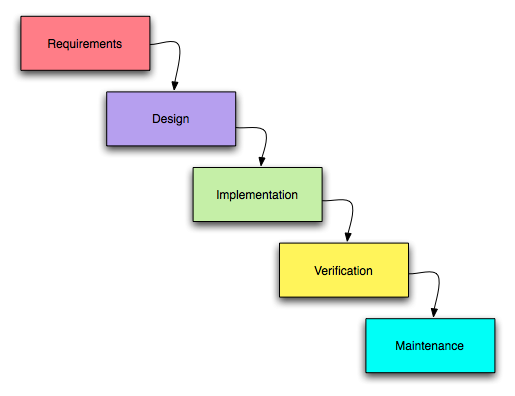

# 11/3/2020
## SDLC
### What is SDLC
- Software Development Lifecycle
- A Process used to design, decelop, and test high quality software
- Describes how a certain software was developed

### Big Bang Model
- 3 phases: Design? Build!!! Test?
- Good for prototypes, learning new languages and implementing some new feature without integrating it into the application

### Waterfall Model
- Rigid
- Highly documented
- You go through each phase once
- Good for project htat require on time delivery
	- Like software for rockets, or military projects

### V-Model
- AKA verification and calidation model
- An extension of the waterfall model and is based on the association of a testing phase for each corresphonding development stage
- the corresponding testing phase of the decelopment phase is planned in parallel

### Agile Development
- Agile is more of a concept than an actual methodology unlike the other models
- It's about being able to develop and deploy software quickly by not wasting time discussing design and planning
- It's about communicating consistently with the client and stakeholders about what they would want in the project and making plans on applying their request in an iterative way so that the current development would be disturbed
[Agile Manifesto](https://agilemanifesto.org/)