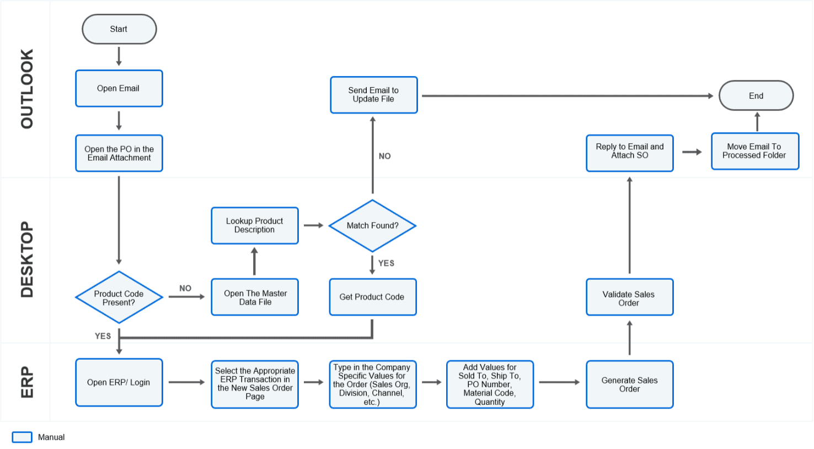
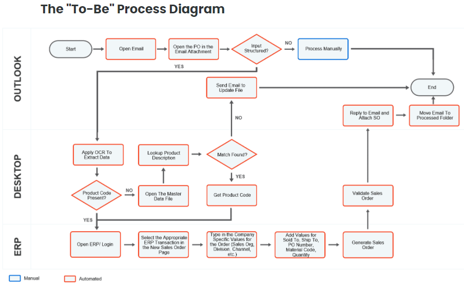

# Introduction to the RPA Developer Role

<!-- @import "[TOC]" {cmd="toc" depthFrom=1 depthTo=6 orderedList=false} -->

<!-- code_chunk_output -->

- [Introduction to the RPA Developer Role](#introduction-to-the-rpa-developer-role)
  - [RPA Developer Journey](#rpa-developer-journey)
      - [UiPath Enablement Journey](#uipath-enablement-journey)
  - [Day in the Life of RPA Dev](#day-in-the-life-of-rpa-dev)
      - [Business Process](#business-process)
      - [Relationship between processes and procedures](#relationship-between-processes-and-procedures)
      - [Process Example](#process-example)
  - [RPA Journey](#rpa-journey)
      - [RPA Implementation stages](#rpa-implementation-stages)
      - [RPA Team](#rpa-team)

<!-- /code_chunk_output -->

## RPA Developer Journey
#### UiPath Enablement Journey
**UiPath Connect!**
- Like social media for UiPath
- connects individual users and partners
- showcase RPA achievements

**UiPath Community Forum**
- Think Stack Overflow
- users can seek help for bugs, development, and features

**UiPath Marketplace**
- Collaborative platfrom for companies and individuals to innovate, contribute, and discover reusable automation components

**UiPath Academy**
- Free online tutorial course

## Day in the Life of RPA Dev
#### Business Process
Successful RPA developer combines technical skill set with the ability to quickly understand business process
- **Definition**: A process is a set of interrrelated or interacting activities that transforms inputs into outputs
- **Components of a process**
  - Inputs: the data that goes in the process
  - Process Flows: the sequences of sub-processes or activites undertaken in the process
  - Source Applications: the applications or systems used to perform teh sub-processes or activites of the process
  - Outputs: the result generated by the process
- **Things to remember**: the outsputs of a process can serve as inputs for other processes

#### Relationship between processes and procedures
A procedure complements a process and describes the way it is carried out. Processes are typically documented via diagram (flowchart, workflow) that aims to highlight the logical sequence of the process steps. Procedure is often documented with a complex written document, focused on providing guidelines.

A procedure explains:
- who is responsible
- when each part needs to occur
- how to handle exceptions
- the specifications applicable to each part of the process

#### Process Example
Order-to-Cash
- A Purchase Order is received via email
- The agent opens the email attachment and checks thtat the product code is present in the PO
- If the product code is Product Code is present in the PO, the agent opens SAP and runs a specific SAP transaction
  - If code not present in PO
    - agent looks it up in the master data file
  - If code present in master data file
    - open SAP and run a specific SAP transaction
  - if code not present in master data file
    - send email to master data analyst to update the file
- Once code provided, populate the required fields in the SAP screen
- Generate the sales order
- Reply to initial email, add sales order in the attachment and move email to processed folder

Process As-Is:

- **Inputs**: the email message
- **Process Flows**: the verificcation of the product code presence, the SAP transaction execution, and the SAP fieilds population
- **Source Applications**: Outlook, Desktop and SAP
- **Outputs**: result generated by the process

## RPA Journey
#### RPA Implementation stages
1. **Prepare RPA**: the processes are defined, assessed, prioritized and the implementation is planned
2. **Solution Design**: Each process ot be automated is documented ("as-is" and "to-be"), the architecture is created and reviewed, the test scenarios and environments are prepared adnt he solution design is created and documented for each process
3. **Build RPA**: The processes are automated, teh workflow is tested and validated and the UAT prepared
4. **Test RPA**: The UAT is performed, the workflow is debugged and the process is signed off
5. **Stabilize RPA**: The Go-Live is prepared, the proces is moved to production, monitored, measured and the lessons learned are documented
6. **Contstant Improvement**: The process auotmation perfmance is assessed, the benefits tracked and the changes managed

#### RPA Team
**Solution Architect**
- defines the artchitecture of the RPA solution
- translated the requirements captured by the function analysts, created the architecture and design artifacts
- lead, advises, and is responsible for ehte developers' team delivery

**Business Analyst**
- mapping of the AS IS and proposed TO BE processes
- hold knowledge of the business process that gets automated, general business process theory and RPA capabilities
- Responsible with listing the process requirements for auotmation, clarifying the inputs and expected outputs, creating RPA documentation

**Implementation Manager/Project Manager**
- Forms and manages RPA team, does resource planning and teams availability
- Most of the time, is the Single Point of Contact for questions

**RPA Developers**
- automate the processes

**Infrastructure and IT Security Admin**
- Responsible for seting up and maintaining hardware and software resources for UiPath

**Process Owner**
- Key stakeholder and beneficiaries of the RPA solution

**RPA Support**
- manage robots after the processes have been moved ot production