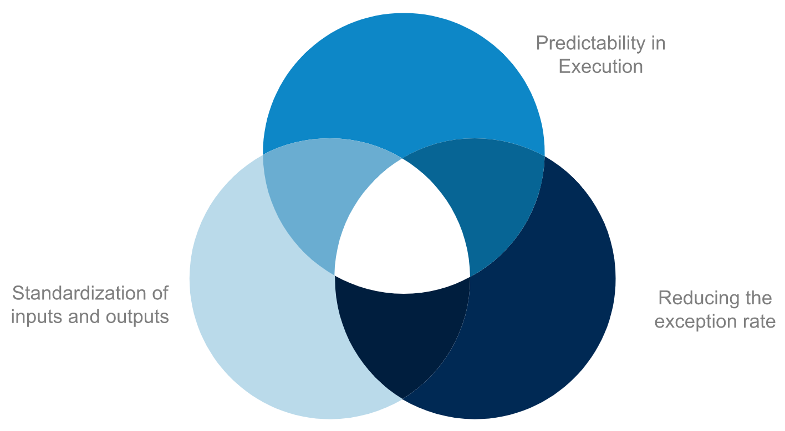

# RPA Advanced Concepts

<!-- @import "[TOC]" {cmd="toc" depthFrom=1 depthTo=6 orderedList=false} -->

<!-- code_chunk_output -->

- [RPA Advanced Concepts](#rpa-advanced-concepts)
    - [Glossary of RPA Terms](#glossary-of-rpa-terms)
    - [Selecting RPA Team](#selecting-rpa-team)
    - [RPA SDLC](#rpa-sdlc)
      - [RPA Development Life Cycle](#rpa-development-life-cycle)
      - [Process Standarization](#process-standarization)
    - [RPA Journey](#rpa-journey)
      - [Selecting the Process to Automate](#selecting-the-process-to-automate)
      - [Planning the RPA Development](#planning-the-rpa-development)
      - [Control Flow in RPA](#control-flow-in-rpa)
      - [The Business Case](#the-business-case)
      - [Challenges in RPA](#challenges-in-rpa)

<!-- /code_chunk_output -->

### Glossary of RPA Terms
***Center of Excellence***
- Governs RPA deployment standards, best practices, support and training capabilities inside an organization
  - Central team that controls the working mechanism of RPA delivery team
  - Responsble for the implementaiton of the automation project
- Types of Center of Excellence
  - Centralized: single RPA CoE serves all the business unit
  - Federated: independent RPA CoEs within each business unit
  - Hybrid: one main CoE is linked to several smaller RPA CoEs dedicated to business units

***Process Design Document***
***Solution Design Document***
***Process Engineering***
***Proof of Concept***

### Selecting RPA Team
The RPA team drives the implementation of the RPA solution. The team comprises of the following members:
**RPA Developer**: Develops RPA solution to meet business needs
**RPA Solution Architect**: Defines the architecture of the RPA solution and ensures its performance
**Infrastructure Engineer**: Maintains and upgrades hardware and software that supports RPA
**Business Analyst**: Uses business process expertise to map the processes to be automated
**Project Manager**: Ensures that the team generates the desired outcome for their organization
**Technical Lead**: Responsible for tactical managemnet of the RPA developers during decelopment and testing stages

### RPA SDLC
Main stages of SDLC are found in RPA Development projects, but there are some specific differnences:
- RPA is faster thatn classic software development
- RPA can utilize wildly varying technologies, deeply or shallowly interfaced
- Business processes are already in production
- RPA generally involves a mix and machine and human elements

#### RPA Development Life Cycle
Categorized in four major parts:
1. **Analysis**: refers to the discovery of automation opportunity from the existing business process
2. **Development**: RPA developer start the development using automation tool
3. **Testing**: the code is tested to check if the product meets all the business requirements
4. **Support and maintenance**: when robot is deployed, it is very important to ensure and monitor the working of the robot

#### Process Standarization
Consists of establishing rules that govern the way to execute a given task or sequence of tasks. THe typical areas of standization are:

### RPA Journey
**Pilot Implementation**: Refers to the first process that is automated and run into production
**The Ramp-up**: The stage in which RPA is applied at alrge scale in the organization. Primary focus of this state is:
- Esablishing best practices
- Optimizing management of the virtual workforce
- Growing internal automation team and expertise
- Qualifying additional processes for automation

#### Selecting the Process to Automate

**Selecting Other Processes**: In addition to the pilot process, other processes that can be categorized for automation are:
- Processes subject to tactical solutions
- Processes subject to standardization/improvement
- Processes subject to changes of input/output

**Easy Processes to Automate**
- Accounts Payable
- Claims Processing
- Contact Center
- Finance and Accounting
- Healthcare Payer

#### Planning the RPA Development
Mix of two different methodlogies used:
- Waterfall
  - Steps defined in advance
  - Success criteria are established from beginning
  - Each step must finihs before the next one can begin
  - Follows 'plan everything first' approach
- Agile
  - Process starts with Discovery Sessions to understand the business and RPA
  - Iterative approach
  - Suitable for frequent changes to ensure a prompt response time

The 6 steps to devloping an RPA project:
1. Analyis
2. Design
3. Development
4. System Integration Testing
5. User Acceptance Testing
6. Warranty

#### Control Flow in RPA
Control flow is the order in which infividual statements, instructions or function calls are executed in a software project. Consists of:
- Continuing at a different point
- Executing only if some condition is met
- Executing until until some condition is met
- Executing and returning
- Preventing any further execution

#### The Business Case
A business case is a well-defined scenario that has quantifiable results.

In RPA, this means looking at the quantifiable benefits of having a business process automated and weighing those benefits against the cost of implementation and maintenance of the RPA solution.

When a company has a single process that would easily provide enough value for the RPA implementation, then it's a very simple decision. However, sometimes multiple processes must be looked at and scoped to establish a business use case that supports the RPA implementation

#### Challenges in RPA

